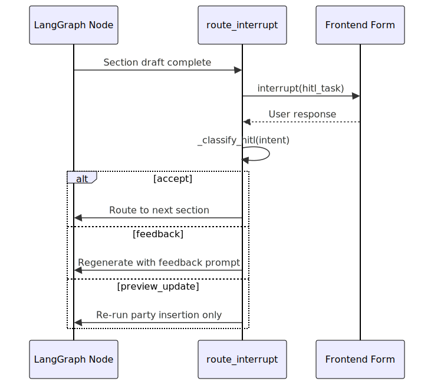
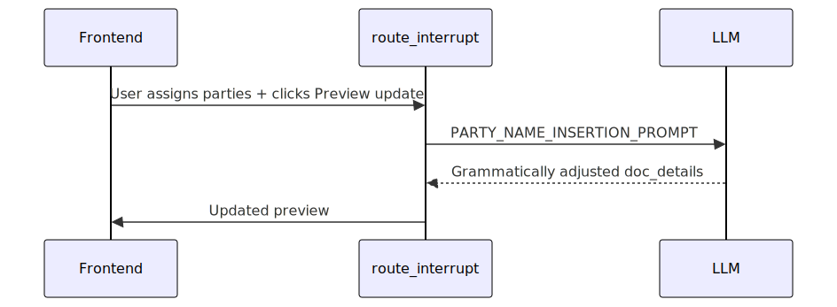

# External Agent — Technical Reference & Architecture Guide

> **Document type:** Reference / Explanation  
> **Audience:** Experienced AI/ML engineers  
> **Last updated:** 16 Jun 2026  
> **Scope:** Post-completion technical reference for the `external_agent` feature in the Smart Investigator platform.

---

## 1. Overview

The **External Agent** generates structured investigation instructions for an external investigator appointed to an insurance fraud claim. It is implemented as a **LangGraph** state machine wrapped inside an **MLflow ResponsesAgent** and runs on **Databricks Mosaic AI**.

The agent guides an internal reviewer through a sequential, human-in-the-loop (HITL) workflow, producing an `ExternalAgentPlan` that contains:

- **Key Concerns** — always generated.
- **Additional Enquiries** — generated if selected.
- **Document Requests** — generated if selected.

Each section is drafted, presented in an editable smart form, reviewed by a human, and only proceeds on acceptance or explicit feedback. Multiple investigation types can be selected; methodology items are deduplicated across types.

### Integration context

- **Entry point:** `external_agent.py` exposes `ExternalAgentResponsesAgent`.
- **Runtime context:** injected by the orchestrator — `request` and `forms` config.
- **Deployment:** registered as an MLflow model and served via Databricks Mosaic AI.

---

## 2. Architecture

### 2.1 Component diagram

### 2.2 File responsibilities

| File | Responsibility |
|------|----------------|
| `external_agent.py` | MLflow entry point. Loads the LangGraph agent, enables autologging/tracing, and registers the model. |
| `external_agent_graph.py` | Core graph implementation — nodes, routing, HITL interrupts, retrieval helpers, deduplication, exclusions. |
| `schemas.py` | Pydantic state and output models. |
| `utils.py` | Converts canonical Pydantic objects to frontend `workflow_stage` / `smart_form` JSON and parses responses back. |
| `prompt_manager/external_agent_prompts.py` | All LLM prompt templates for drafting and feedback. |
| `prompt_manager/knowledge_prompts.py` | Prompts for extracting and synthesising methodology knowledge. |
| `prompt_manager/standards.py` | LOB-specific SME gold-standard phrasing for document requests. |
| `tools/query_investigation_process.py` | **Shelved.** Previously called a Databricks serving endpoint for investigation processes; the current implementation reads chunks directly from a textbook delta table instead. |

### 2.3 Tech stack

| Layer | Technology |
|-------|------------|
| Orchestration | LangGraph |
| Model serving | MLflow + Databricks Mosaic AI |
| LLM | Azure OpenAI (via foundation `get_llm`) |
| Frontend forms | Custom `workflow_stage` / `smart_form` JSON protocol |
| Deployment | Databricks model serving endpoint |

---

## 3. Workflow / State Machine

### 3.1 Graph flow

### 3.2 Execution order

The graph executes sections **sequentially** so the frontend can review one section at a time:

1. **Key Concerns**
2. **Additional Enquiries**
3. **Document Requests**

### 3.3 Node descriptions

| Node | Purpose |
|------|---------|
| `initialise_query` | Collects required claim context via an initial form. If context is already present, proceeds to `dispatch_sections`. |
| `dispatch_sections` | Thin routing node that always sends execution to `generate_key_concerns`. |
| `generate_key_concerns` | Drafts key concerns from IRO-flagged sections in `initial_review`. |
| `generate_enquiries` | Drafts additional enquiries from the claim context and retrieved methodology. |
| `generate_doc_request` | Runs the 3-call document request pipeline. |
| `assemble_plan` | Combines accepted section outputs into an `ExternalAgentPlan`. |
| `finalise_plan` | Builds a read-only markdown view and emits the original form data as a separate artifact. |

### 3.4 HITL pause / resume loop

After each generation node, `route_interrupt` pauses execution and sends a HITL task to the frontend.

The classifier resolves the user's intent into one of:

- `accept`
- `feedback`
- `preview_update` (document request review only)
- `ambiguous`
- `unrelated`

---

## 4. Data Model & State

### 4.1 State schema

`ExternalAgentState` extends LangGraph's `MessagesState` and carries:

### 4.2 Output schemas

| Schema | Purpose |
|--------|---------|
| `KeyConcernSet` | List of `KeyConcern(concern, rationale)` |
| `AdditionalEnquiriesSet` | List of `AdditionalEnquiries(enquiry, enquiry_detail)` |
| `DocRequestSet` | List of `DocRequest(doc_type, doc_details, assigned_parties, doc_details_original)` |
| `ExternalAgentPlan` | Aggregated container with concern set, document set, enquiry set, version, timestamp |
| `HITLDecision` | `intent`, `task_summary` |
| `PartyNameInsertionOutput` | Wrapper for LLM-based party name insertion result |

### 4.3 Frontend form mapping

`utils.py` handles the bidirectional translation between:

- **Canonical Pydantic objects** (used by the graph)
- **Frontend JSON** (`workflow_stage` / `smart_form` payload)

Key functions:

- `build_form_*` — serialises Pydantic models into editable frontend forms.
- `parse_form_to_*` — parses the frontend's flat form payload back into Pydantic models.

---

## 5. Knowledge Retrieval & Methodology Pipeline

The agent retrieves investigation methodology relevant to the claim's line of business (LOB) and fraud types for **document requests** and **additional enquiries**. **Key concerns** are derived directly from IRO-flagged sections in `initial_review` and do not use the methodology retrieval path.

> **Note:** The earlier approach of calling a Databricks serving endpoint (`tools/query_investigation_process.py`) has been shelved. The current implementation reads methodology chunks directly from a loaded textbook delta table and runs extraction prompts against them.

### 5.1 Retrieval flow

### 5.2 Chunk retrieval and synthesis

`_retrieve_section_chunks_async` filters a loaded textbook dataframe (`df`) by LOB, fraud type, and resolved stage, then:

1. Concatenates matching `chunk_data` entries for the investigation type.
2. Runs a knowledge-extraction prompt over the combined chunks.
3. Synthesises the extracted facts into section-specific schemas (e.g., `DocRequestSet`, `AdditionalEnquiriesSet`).

> **Deployment note:** The global textbook dataframe `df` is expected to be available at graph construction time with columns `lob`, `fraud_type`, `stage`, and `chunk_data`.

The raw knowledge JSON is cached in state (`doc_request_knowledge`, `enquiries_knowledge`) so feedback regeneration can reuse the same source material.

### 5.3 Cross-investigation-type deduplication

When multiple investigation types are selected, `_dedup_section_items()` runs an LLM judge to collapse duplicate methodology items across types while preserving intra-type duplicates.

---

## 6. Section Generation Deep Dives

### 6.1 Key Concerns

**Purpose:** Surface the most important issues or inconsistencies the external investigator should focus on.

**Inputs:**

- `initial_review`
- `additional_info`
- `investigation_type`

**Process:**

1. Extract IRO-flagged concern sections from `initial_review` (`CONCERNS`, `IRO CONCERNS`, `KEY CONCERNS`).
2. Classify each item as `CONCERN` (finding) or `OBSERVATION` (process note).
3. Consolidate same-subject concerns and fold observations into related concern rationales.
4. Anchor each concern with specific facts from `initial_review` or `additional_info`.
5. Synthesise into a `KeyConcernSet`.
6. Present in HITL form for review.

### 6.2 Additional Enquiries

**Purpose:** Generate interview questions or lines of enquiry for the external investigator.

**Inputs:**

- Claim context (`initial_review`, `additional_info`)
- Retrieved enquiry methodology

**Process:**

1. Retrieve methodology chunks for additional enquiries.
2. Apply relevance filtering against `initial_review` and `additional_info`.
3. Supplement with narrative-driven enquiries from the claimant's incident account.
4. Aggregate by theme and synthesise into an `AdditionalEnquiriesSet`.
5. Present in HITL form for review.

### 6.3 Document Requests

**Purpose:** Produce a concrete list of documents to request from parties involved in the claim.

The document request node runs a **3-call pipeline** plus a deterministic pre-filter:

#### 6.3.1 Layer 0 — Hard-exclusion pre-filter

`strip_hard_exclusions` runs before the LLM sees any methodology data. It uses word-boundary regex matching to check `initial_review` + `additional_info` for factual-hook keywords per document type. Document types with no factual hook are stripped entirely.

#### 6.3.2 Call 1 — Relevance filter

`DOC_REQUEST_RELEVANCE_PROMPT` enforces a strict include-only relevance gate:

- Every document type starts as **EXCLUDED**.
- A document is moved to **INCLUDED** only if a factual hook exists in the case narrative.
- Catch-all entries are assessed sub-item by sub-item.

#### 6.3.3 Call 2 — SME gold-standard wording

`DOC_REQUEST_SME_PROMPT` normalises included document requests against LOB-specific SME phrasing in `standards.py`.

- Most templates are filled verbatim.
- Only a small set of placeholder types are filled by the LLM.

#### 6.3.4 Call 3 — Narrative derivation

`NARRATIVE_DOC_REQUEST_DRAFT_PROMPT` derives 0–2 concrete document requests from the claimant's own incident account in `initial_review`.

Scope is intentionally limited to **objective, verifiable causes** — work arrangements, service bookings, physical circumstances, logistics, business records. It does not derive documents from psychological or emotional explanations.

#### 6.3.5 Party assignment and insertion

Document requests support party assignment chips in the frontend.

`PARTY_NAME_INSERTION_PROMPT` inserts grammatically correct possessive party names into `doc_details`. The original unmodified text is preserved in `doc_details_original` for idempotency.

---

## 7. Human-in-the-Loop Design

### 7.1 HITL task preparation

Each generation node uses `prepare_hitl_task()` from the foundation HITL module to build a frontend task payload containing:

- The section rendered as an editable smart form.
- Action buttons (Accept / Provide Feedback / Preview update).
- Metadata for routing.

### 7.2 Intent classification

`_classify_hitl()` uses an LLM to classify the user's free-text response into a structured `HITLDecision`.

### 7.3 Feedback regeneration

On `feedback`, the previous section output is serialised and fed into a `SECTION_FEEDBACK_PROMPT` call. The regenerated output is re-presented for review.

### 7.4 State caching

Raw per-section knowledge is cached in state so that feedback regeneration does not need to re-run retrieval. The final assembled plan uses only accepted section outputs.

---

## 8. Design Decisions & Permanent Constraints

### 8.1 Sequential section execution

Sections run sequentially rather than in parallel. This allows the frontend to present and review one section at a time and keeps the HITL payload focused.

### 8.2 Deterministic + LLM layered filtering

Document requests use a two-layer defence against irrelevant requests:

1. **Deterministic pre-filter** (`strip_hard_exclusions`) removes methodology items with no factual hook.
2. **LLM relevance prompt** applies a strict include-only gate to whatever remains.

### 8.3 SME-controlled wording

Document request wording is normalised against SME-authored gold standards. The LLM only fills a restricted set of placeholders; all other template text passes through verbatim to preserve compliance-approved language.

### 8.4 Narrative derivation scope

Narrative-driven document derivation applies only to **objective, concrete causes**. It intentionally does not derive documents from psychological or emotional explanations.

### 8.5 Party name insertion via LLM

Party name insertion is performed by an LLM prompt rather than deterministic string replacement. This handles complex grammar (determiners, possessives, alternative constructs) more robustly than regex-based substitution.

### 8.6 State persistence

A global `use_checkpointer` toggle controls whether state is maintained by a checkpointer or serialised into the HITL payload. The base agent class falls back to a stateless memory saver when checkpointer is disabled.

---

## 9. Appendix: Quick Reference

### 9.1 File-to-concern mapping

| Concern | File |
|---------|------|
| Entry point / MLflow wiring | `external_agent.py` |
| Graph logic, routing, HITL, retrieval | `external_agent_graph.py` |
| Data models / state | `schemas.py` |
| Frontend form builders & parsers | `utils.py` |
| LLM drafting prompts | `prompt_manager/external_agent_prompts.py` |
| Methodology extraction / dedup prompts | `prompt_manager/knowledge_prompts.py` |
| SME wording standards | `prompt_manager/standards.py` |
| Textbook delta table chunk retrieval | `external_agent_graph.py` (`_retrieve_section_chunks_async`) |
| Shelved endpoint retrieval tool | `tools/query_investigation_process.py` |

### 9.2 Prompt summary table

| Prompt | Purpose | Inputs | Output |
|--------|---------|--------|--------|
| `KEY_CONCERNS_DRAFT_PROMPT` | Draft key concerns from IRO-flagged sections in claim context. | `initial_review`, `additional_info`, `investigation_type` | `KeyConcernSet` |
| `ADDITIONAL_ENQUIRIES_RELEVANCE_PROMPT` | Filter and contextualise methodology enquiries against case facts. | `initial_review`, `additional_info`, enquiries knowledge | Filtered/contextualised enquiries |
| `ADDITIONAL_ENQUIRIES_FINAL_PROMPT` | Aggregate methodology + narrative enquiries by theme and finalise. | Previous version, `initial_review`, `additional_info` | `AdditionalEnquiriesSet` |
| `DOC_REQUEST_RELEVANCE_PROMPT` | Filter methodology docs by factual relevance. | Raw methodology, claim narrative | Filtered doc list |
| `DOC_REQUEST_SME_PROMPT` | Normalise wording against SME gold standards. | Filtered docs | SME-aligned docs |
| `NARRATIVE_DOC_REQUEST_DRAFT_PROMPT` | Derive docs from claimant narrative. | Initial review | 0–2 narrative-derived docs |
| `SECTION_FEEDBACK_PROMPT` | Regenerate a section from user feedback. | Previous output, feedback text | Revised section output |
| `PARTY_NAME_INSERTION_PROMPT` | Insert possessive party names into doc details. | Doc details, assigned parties | Updated doc details |
| `DEDUP_PROMPT` | Deduplicate items across investigation types. | Section items per type | Deduplicated section items |

### 9.3 Common extension points

| Extension | Where to change |
|-----------|-----------------|
| Add a new LOB | `schemas.py` validation + `standards.py` gold-standard templates |
| Add a new document type | `standards.py` + hard-exclusion rules in `external_agent_graph.py` |
| Change HITL form layout | `utils.py` form builders |
| Update textbook delta table source | The delta table loader / `df` source in `external_agent_graph.py` |
| Add new prompt guardrails | `prompt_manager/external_agent_prompts.py` |

---

## Confluence Upload Notes

- **Diagrams** are embedded as **SVG images** in the Markdown doc. In Confluence, they will import as static image attachments.
- To make a diagram editable in Confluence:
  1. Download the corresponding **SVG file** from `docs/diagrams/external-agent/`.
  2. In Confluence, insert a **Gliffy** diagram.
  3. Use **File → Import → SVG** to import the SVG into Gliffy.
  4. Gliffy will convert the shapes to editable objects. Save the diagram as `.gliffy` in Confluence.
- The `.mmd` source files are kept alongside the SVGs for future regeneration if needed.
- **Code blocks** use Markdown fenced syntax; Confluence will render them as code macros on Markdown import.
- **Info / warning callouts** can be converted to Confluence `info` / `warning` macros.
- If publishing via the Atlassian MCP, convert this Markdown body to **Confluence storage-format XHTML** before calling `createConfluencePage`.
